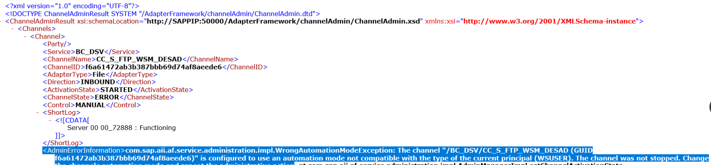
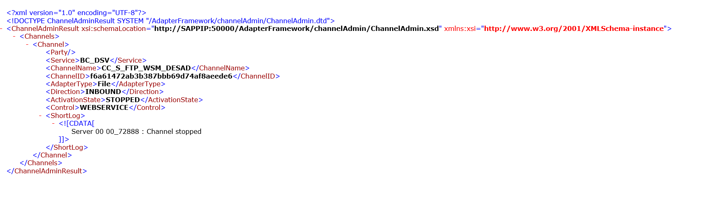
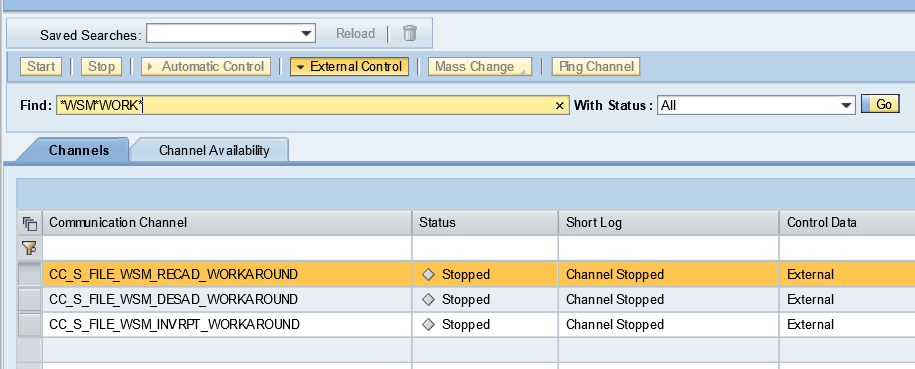

# Gestion de canales remota

Utilidad para conocer el estado de los canales de PI y arrancarlos o pararlos via url.


### Conocer status de los canales:
* Todos los canales: 
````
http://{piserverip}:50000/AdapterFramework/ChannelAdminServlet?action=status&party=*&service=*&channel=*
````

* De un BS o BC:
````
http://{piserverip}:50000/AdapterFramework/ChannelAdminServlet?action=status&party=*&service=BC_DSV&channel=*
````

* De un canal concreto:
````
http://{piserverip}:50000/AdapterFramework/ChannelAdminServlet?action=status&party=*&service=BC_DSV&channel=CC_S_FTP_WSM_DESAD
````

### Arrancar o parar un canal:

* Arrancar el canal
````
http://{piserverip}:50000/AdapterFramework/ChannelAdminServlet?action=start&party=*&service=BC_DSV&channel=CC_S_FTP_WSM_DESAD
````

* Parar el canal
````
http://{piserverip}:50000/AdapterFramework/ChannelAdminServlet?action=stop&party=*&service=BC_DSV&channel=CC_S_FTP_WSM_DESAD
````

Esto solo se puede realizar si el canal está en `External Control`

[Fuente: blogs.sap](https://blogs.sap.com/2007/05/04/control-communication-channels-externally-without-using-rwb/)

***

Si no está en `External Control` dará el siguiente error:



En caso contrario podremos pararlo satisfactoriamente:



Ejemplo de canales con external control activado:



***

*Thanks to: Alberto Maeso*