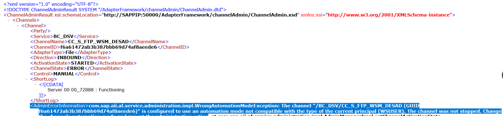
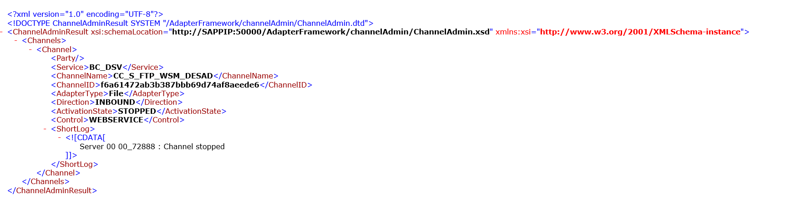
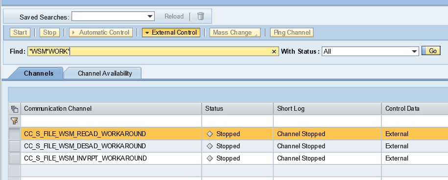

Utilidad para conocer el estado de los canales de PI y arrancarlos o pararlos via url.

Las urls son estás:

Obtener status. Ejemplos
todos los canales: http://10.79.0.91:50000/AdapterFramework/ChannelAdminServlet?action=status&party=*&service=*&channel=*
De un BS o BC: http://10.79.0.91:50000/AdapterFramework/ChannelAdminServlet?action=status&party=*&service=BC_DSV&channel=*
De un canal: http://10.79.0.91:50000/AdapterFramework/ChannelAdminServlet?action=status&party=*&service=BC_DSV&channel=CC_S_FTP_WSM_DESAD

Para el status no hace falta nada.

Arrancar o parar un canal:

http://10.79.0.91:50000/AdapterFramework/ChannelAdminServlet?action=stop&party=*&service=BC_DSV&channel=CC_S_FTP_WSM_DESAD
http://10.79.0.91:50000/AdapterFramework/ChannelAdminServlet?action=start&party=*&service=BC_DSV&channel=CC_S_FTP_WSM_DESAD
Por defecto, da un error y no puede parar ese canal:

Para que eso funcione el canal tiene que estar en estado External control como dicen aquí:

https://blogs.sap.com/2007/05/04/control-communication-channels-externally-without-using-rwb/

Ejemplo de canales con external activado:

Thanks to: Alberto Maeso