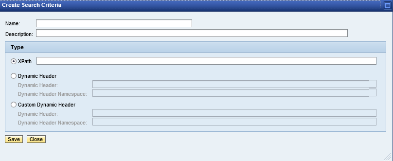
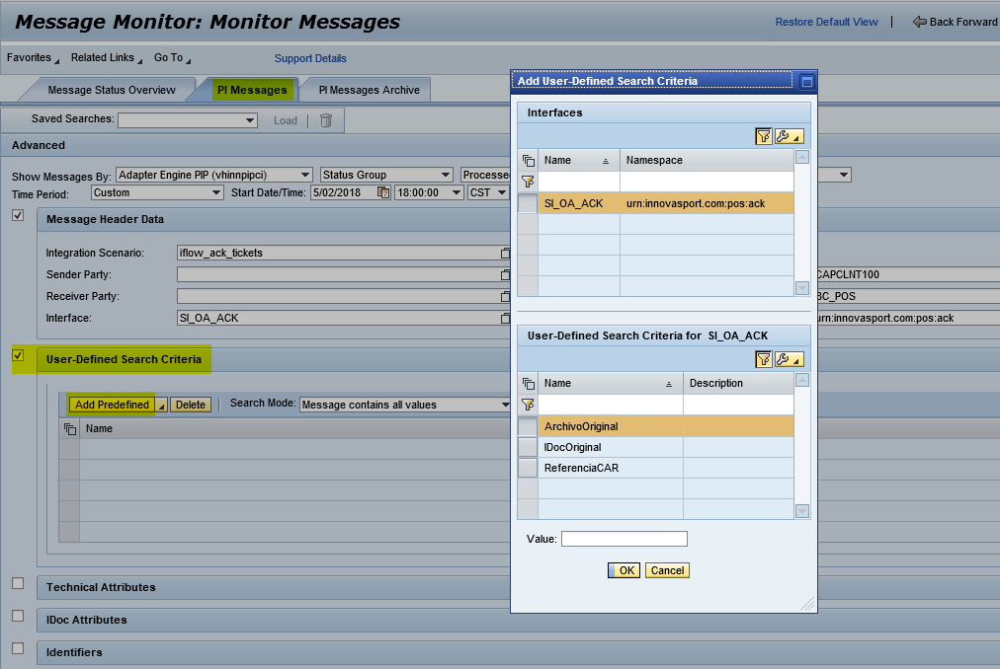

# Message Monitoring Indexing

En ocasiones, a la hora de monitorizar o comprobar si un mensaje se ha mapeado y enviado correctamente, se nos hace bastante tedioso ir buscando entre todos los mensajes hasta encontrar el mensaje concreto que necesitamos.

Para ello disponemos de una herramienta en el Message Monitor que nos permite indexar mensajes a partir de un campo XPATH para una interface concreta.

Aquí tenemos un ejemplo de mensaje del que vamos a tomar los tres campos marcados para indexar esta interface:

---

## 1. Crear indices para la interface

Desde entrada `Configuration and Monitoring Home`:

Seleccionamos la pestaña `Configuration and Administration > Adapter Engine > User-Defined Message Search Configuration.`

Lo primero es crear la entrada para la interface en la que vamos a crear el índice:

Pulsamos el botón: `New`

En el popup emergente selecionamos `Create`

Y rellenamos con los valores de nuestra interface, teniendo especial atención en marcar el indicador `Active`.

que podemos obtener desde la vista del Message Monitor.

El siguiente paso es crear un `Search Criteria` para la entrada creada anteriormente, pulsando sobre `New.`

Ahí estableceremos un nombre para nuestro `Search Criteria`, una descripción (opcional) y el `XPath` del campo que deseamos indexar.

Según el XML que pusimos antes de ejemplo las expresiones XPath que utilizaremos son:

>`Arcivo Original: /n0:offlineAck/archivoIntercambioOriginal`

>`IDoc Original: /n0:offlineAck/detallesTratamiento/detalleTratamiento/Localizador`

>`Referencia CAR: /n0:offlineAck/referenciaIntercambioOriginal/InterchangeControlRef`

Ahora para que funcione debemos definir el namespace del elemento n0 que hemos utilizado en nuestros `XPath` anteriores.

Para ello selecionamos la pestaña `Prefixes > New.`

Rellenamos los valores del popup:

Guardamos y ya tendríamos preparados los índices para los tres campos que hemos incluido.

A partir de este momento todos los mensajes que se envíen a través de esta interface se podrán buscar por estos índices, facilitando enormemente la tarea de monitorización.

Ahora bien, los mensajes que hubiera antes de la creación del índice no podremos buscarlos por este método.

---

## 2. Indexar mensajes anteriores a la creación del índice

Es posible lanzar un job de indexación para mensajes anteriores a la creación de los índices del punto anterior.

Para ello, desde la misma ventana desde la que los hemos creado seleccionamos `Indexing Options`

Selecionamos el rango de fechas de los mensajes que queremos indexar para esa interface y pulsamos `Start indexing`

Debemos esperar a que termine el job y podemos ir comprobando el estado pulsando sobre el botón `Indexing status`.

---

## 3. Utilizar los indices creados

Una vez los índices están correctamente creados y los mensajes indexados podemos utilizar estos nuevos criterios de búsqueda desde el `Message Monitior`

Ahora podemos encontrar un nuevo bloque llamado `User-Defined Search Criteria` donde podremos añadir como criterio de búsqueda los índices creados en el punto 1.

Pulsamos sobre `Add Predefined` selecionamos el índice a utilizar, establecemos el valor que deseamos filtrar mediante el campo `Value` y pulsamos el botón inferior `Go`

Así encontraremos el mensaje esperado:

---

*Enjoy :)*
*César Fernández*